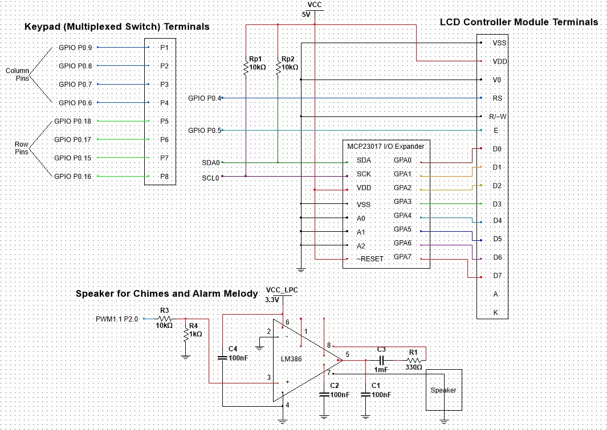

# Digital-Alarm-Clock

The purpose of this project was to create a digital alarm clock using the LPC1769 microcontroller, a 4x4 multiplexed keypad, an LCD module with a HD44780 controller, and LM386 for audio.

#### User Manual

To set the clock time, the ‘C’ key must be pressed.  To set the alarm time, the ‘A’ key must be pressed. In either case, the LCD display will prompt the user for the time in the form HH:MM:SS, where each value must be set sequentially. After entering in a time, the display will go back to showing the clock time and alarm time, updated as necessary. 

When the alarm time is reached a quick melody will be played through the speaker, and a message notifying the user the alarm time has been reached will be displayed on the LCD.

The appropriate Westminster chimes play on the 00-, 15-, 30-, and 45-minute markers of each hour. However, if the clock system is busy (user is setting alarm/clock time or another sound is playing), the chimes or alarm will not play. A message regarding the specific chime will also be displayed on the LCD to the user.

